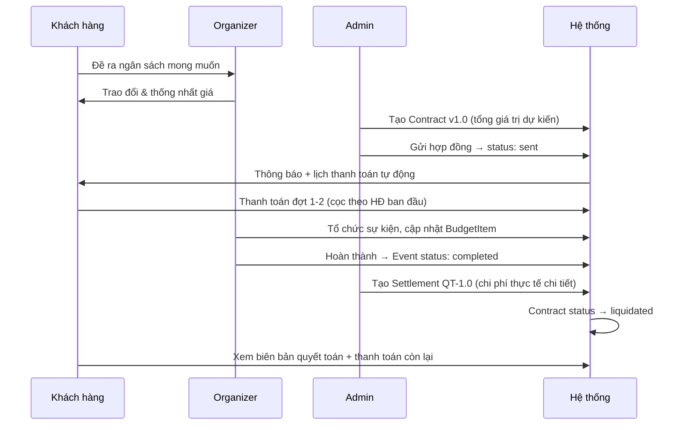

# Tính Năng: Biên Bản Quyết Toán / Thanh Lý Hợp Đồng (Settlement)

## Bối cảnh

Quy trình tổ chức sự kiện NiChan gồm 2 giai đoạn hợp đồng:

1. **Hợp đồng ban đầu (v1.0)** — Sau khi khách hàng đề ra ngân sách mong muốn, organizer trao đổi và thống nhất mức giá hợp lý → ký hợp đồng với **tổng giá trị dự kiến** (không cần bảng chi tiết line items).
2. **Biên bản quyết toán (QT-1.0)** — Sau khi hoàn thành sự kiện, admin lên lại chi tiết từng hạng mục thực tế (tham khảo từ `BudgetItem.actualAmount`) → thanh lý hợp đồng.

## Flow hoàn chỉnh



### Ví dụ thực tế

| Giai đoạn | Nội dung | Giá trị |
|---|---|---|
| HĐ ban đầu | Tổng giá trị dự kiến | 250.000.000 đ |
| Đợt cọc 1 | 50% theo HĐ ban đầu | 125.000.000 đ |
| Đợt cọc 2 | 30% theo HĐ ban đầu | 75.000.000 đ |
| Quyết toán | Tổng chi phí thực tế (chi tiết) | 240.000.000 đ |
| Đợt cuối | Chênh lệch: 240tr - 200tr đã cọc | 40.000.000 đ |

---

## Database

### ContractVersion — field `purpose`

Thêm field `purpose` vào model `ContractVersion` để phân biệt version gốc vs quyết toán:

```prisma
model ContractVersion {
  id           String   @id @default(uuid())
  contractId   String   
  versionLabel String   
  purpose      String   @default("original") // "original" | "settlement"
  scopeText    String   
  paymentTerms String   
  generalTerms String   
  documentUrl  String?  
  createdById  String   
  createdAt    DateTime @default(now())
}
```

Migration: `20260712160942_add_contract_version_purpose`

---

## Backend API

### Schema (`admin-contracts.schema.ts`)

```typescript
export const createSettlementSchema = z.object({
  lineItems: z.array(contractLineItemSchema).min(1).optional(),
  scopeText: z.string().min(1).optional(),
  generalTerms: z.string().min(1).optional(),
});
```

### Service (`admin-contracts.service.ts`)

#### `getSettlementPreview(contractId)`
- Lấy `BudgetItem` có `actualAmount > 0` từ event
- Tính tổng chi phí thực tế vs giá trị hợp đồng ban đầu
- Trả về: danh sách line items, tổng, chênh lệch, số hạng mục

#### `createSettlementVersion(contractId, createdById, input?)`
- Kiểm tra contract không bị `cancelled`, chưa có settlement version
- Nếu admin gửi `lineItems` → dùng dữ liệu admin nhập
- Nếu không → chuyển `BudgetItem.actualAmount` → `ContractLineItem`
- Tạo `ContractVersion` mới: `purpose: "settlement"`, `versionLabel: "QT-1.0"`
- Cập nhật `Contract.totalValue`, `currentVersion`, `status → "liquidated"`
- Ghi log activity + gửi notification cho khách hàng

### Routes (`admin-contracts.router.ts`)

| Method | Path | Mô tả |
|--------|------|-------|
| `GET` | `/api/admin/contracts/:id/settlement-preview` | Xem trước dữ liệu quyết toán |
| `POST` | `/api/admin/contracts/:id/settlement` | Tạo biên bản quyết toán |

---

## Frontend

### Hợp đồng ban đầu (tạo mới)

**Form tạo hợp đồng** (`AdminContracts.tsx`):
- Chỉ cần nhập **tổng giá trị dự kiến** (không cần bảng chi tiết)
- Phạm vi công việc, điều khoản thanh toán, điều khoản chung

**Template hợp đồng gốc** (`ContractDocument.tsx`):
- Tiêu đề: "HỢP ĐỒNG DỊCH VỤ TỔ CHỨC SỰ KIỆN"
- Chỉ hiện tổng giá trị + ghi chú: "Chi tiết sẽ được quyết toán sau khi sự kiện hoàn thành"
- Không có bảng QuotationTable

### Biên bản quyết toán

**Dialog quyết toán** (`AdminContracts.tsx`):
- Khi bấm "Tạo biên bản quyết toán" → gọi `settlement-preview` API
- Hiện form **có thể chỉnh sửa**:
  - Các hạng mục pre-fill từ budget (admin có thể sửa/thêm/xóa)
  - Tổng tự động tính khi chỉnh sửa
  - So sánh giá trị gốc vs thực tế
- Xác nhận → gọi `POST settlement` API

**Template biên bản thanh lý** (`ContractDocument.tsx`):
- Tiêu đề: "BIÊN BẢN NGHIỆM THU VÀ THANH LÝ HỢP ĐỒNG"
- Tham chiếu hợp đồng gốc (số HĐ, ngày ký)
- Bảng chi phí thực tế (QuotationTable) + so sánh với giá trị ban đầu
- Điều khoản thanh lý

### Trang xem hợp đồng (`ContractView.tsx`)

- Toggle chuyển đổi giữa "Hợp đồng gốc" và "Biên bản quyết toán"
- Hỗ trợ URL param `?view=settlement` để auto-select
- PDF export kèm suffix `_quyet-toan` cho settlement

### Trang theo dõi sự kiện (`EventTracking.tsx`)

- Tab "Nghiệm thu & quyết toán" ưu tiên hiện line items từ settlement version
- Nút "Xem biên bản quyết toán" khi có contract đã thanh lý

---

## Files đã thay đổi

### Backend
| File | Thay đổi |
|------|----------|
| `prisma/schema.prisma` | Thêm `purpose` field vào `ContractVersion` |
| `admin-contracts.schema.ts` | Thêm `createSettlementSchema` |
| `admin-contracts.service.ts` | Thêm `getSettlementPreview`, `createSettlementVersion` |
| `admin-contracts.router.ts` | Thêm 2 route: preview + create settlement |

### Frontend
| File | Thay đổi |
|------|----------|
| `ContractDocument.tsx` | Template biên bản thanh lý mới + bỏ bảng chi tiết ở HĐ gốc |
| `ContractView.tsx` | Toggle chuyển đổi version + URL param |
| `AdminContracts.tsx` | Form tạo HĐ đơn giản + dialog quyết toán editable |
| `EventTracking.tsx` | Ưu tiên settlement version + nút xem biên bản |

---

## Verification

| Kiểm tra | Kết quả |
|----------|---------|
| Backend `tsc --noEmit` | ✅ Passed |
| Frontend `tsc --noEmit` | ✅ Passed |
| Prisma migration | ✅ Applied |

### Kiểm thử thủ công
1. Tạo contract v1.0 (chỉ nhập tổng giá trị) → gửi cho khách hàng
2. Thêm BudgetItem với `actualAmount` cho event
3. Bấm "Tạo biên bản quyết toán" → chỉnh sửa line items → xác nhận
4. Kiểm tra contract status chuyển sang `liquidated`
5. Khách hàng xem ContractView → toggle giữa HĐ gốc và biên bản thanh lý
6. Xuất PDF biên bản thanh lý → kiểm tra layout
